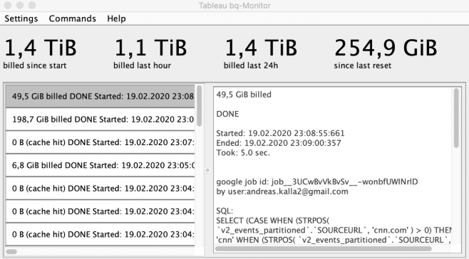

# BQ-Monitor
If you connect Tableau to a large data set in Google Bigquery, this tool will help you get more insights. 
Notice: The tool is in beta stage currently.

Features
- Get a real-time overview of the current query costs
- Examine all SQL queries to BigQuery that are generated in the background
- Real-time update as JSON list to load back into the tableau

# Starting the app (v.1 beta)
To start the App load the jarfile into a folder, open a terminalsession and type "java -jar bq-monitor-v1.jar".
In current version DEBUG Logs are printed to the terminal.
See requirments below.

# Requirements
In short you need: Java 1.8, Tableau and a Google Cloud BigQuery Service account. Details see below:

## Local requirements to run the tool
- at least Java 1.8 (OpenJDK)
- Tableau Version since 2019.4 released 10/2019 (older Versions are untested, by may work as well). Note that newer versions might have changed the Log Format.
  
- Knowledge where the Tableau Respository is located (can be checked within Tableau: Menue File > Open Repository Location)

## BigQuery requirements
- Google Cloud project
- BigQuery API must be set to "enabled"
- Service Account with the rights to access all users log (Role BigQuery-Admin). Please note, that the Role BigQuery Logs-User is not sufficient in current implementation, because it would only show the Queries taken with the service account itself (what would normally be emtpy).
- export a keyfile als json for that user and place it as "key.json" next to the applications jar file.

# Architecture

